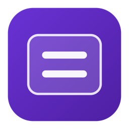
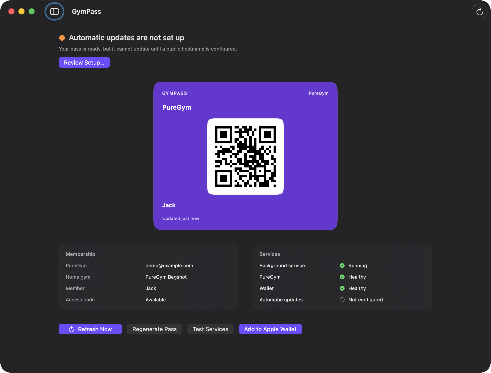
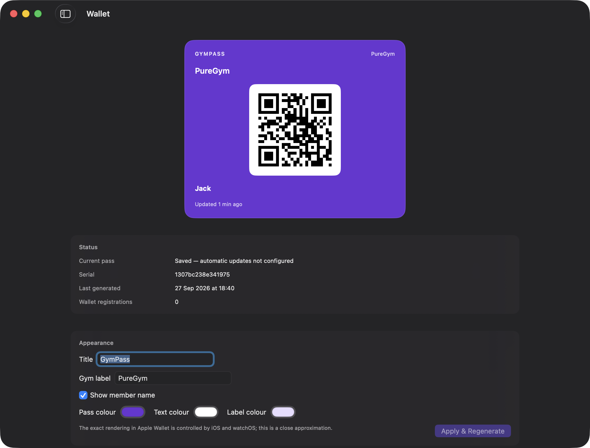
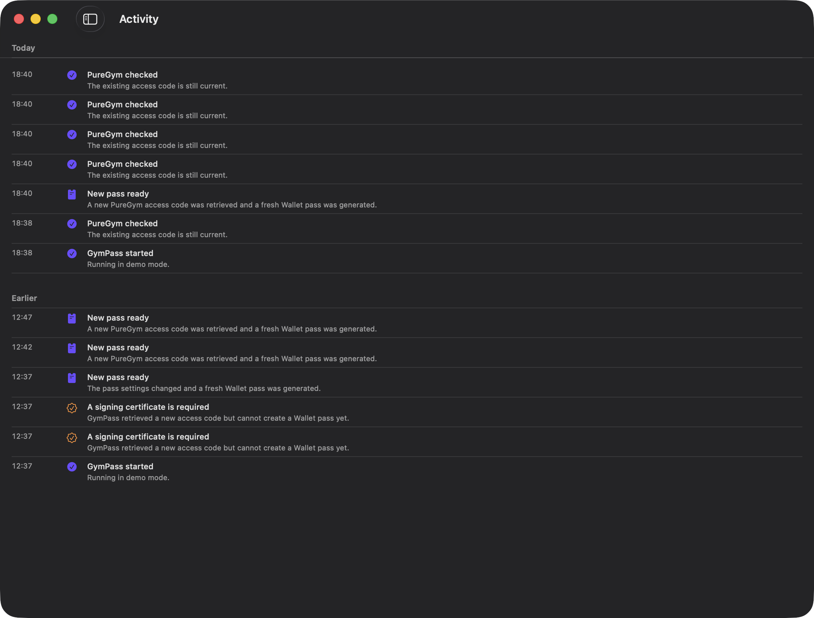
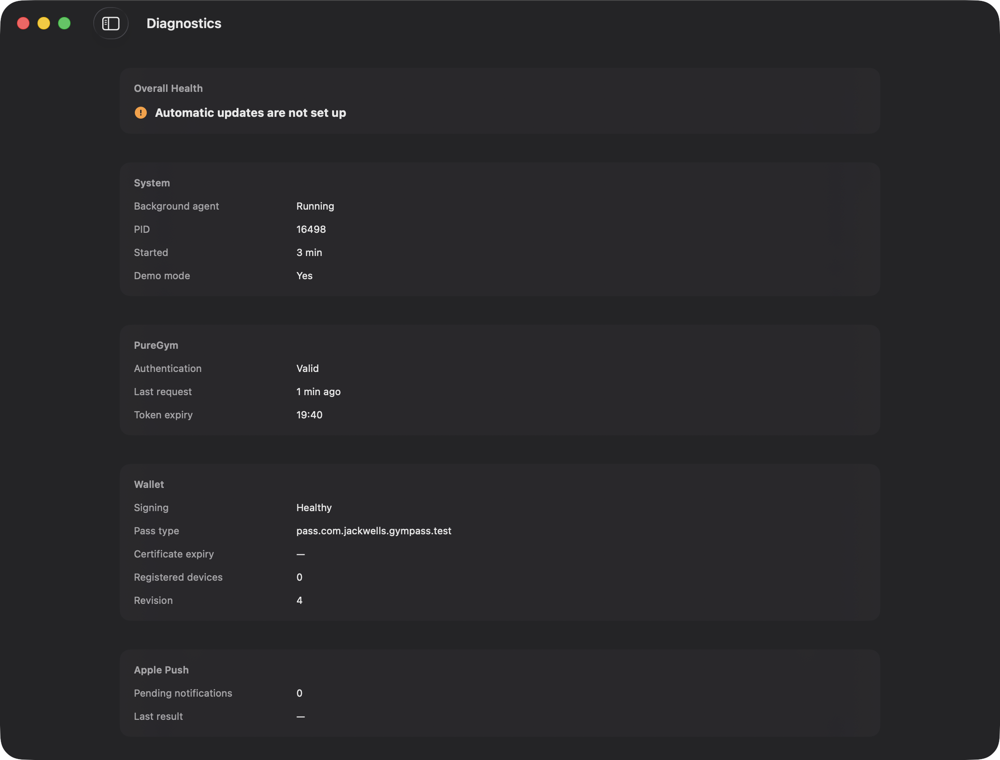
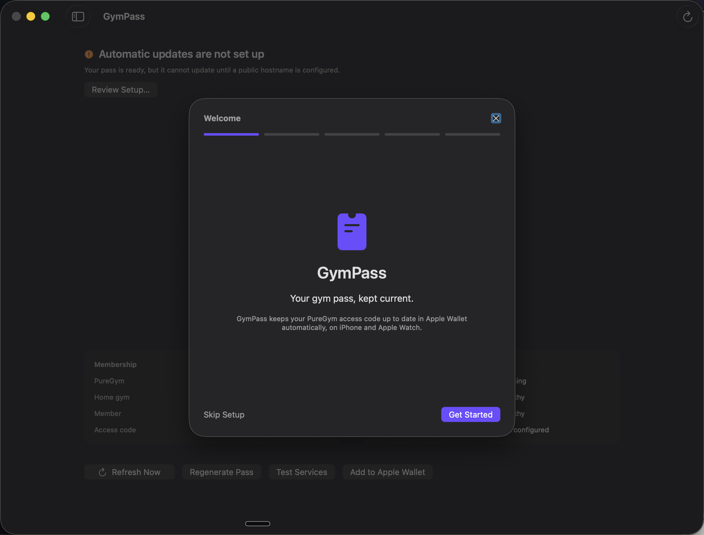
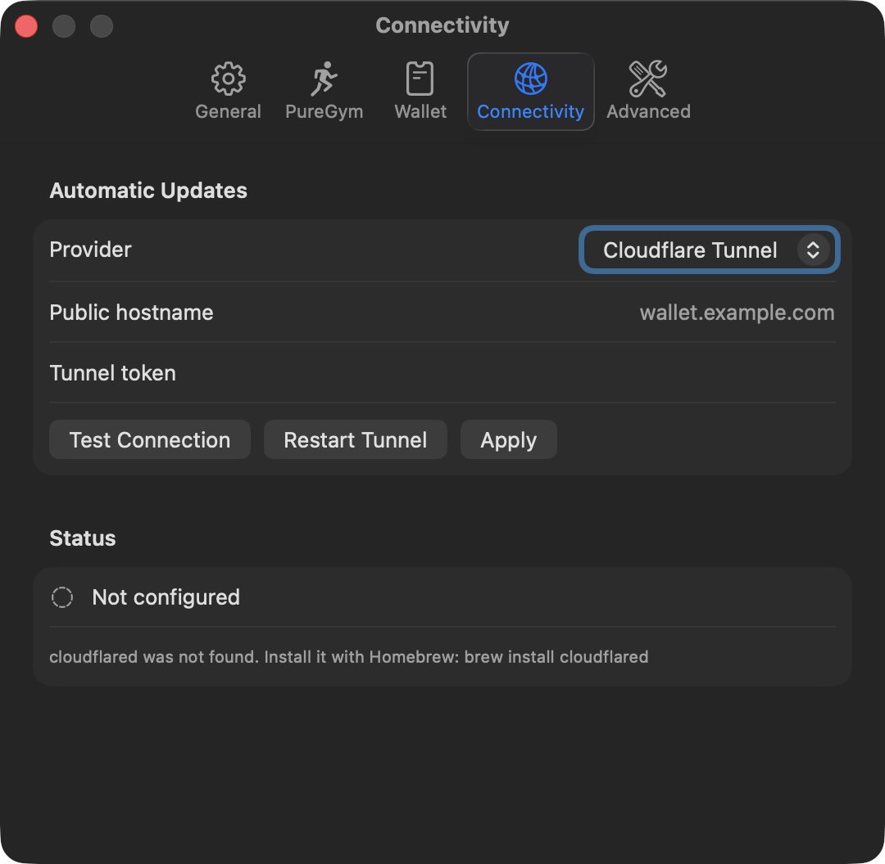
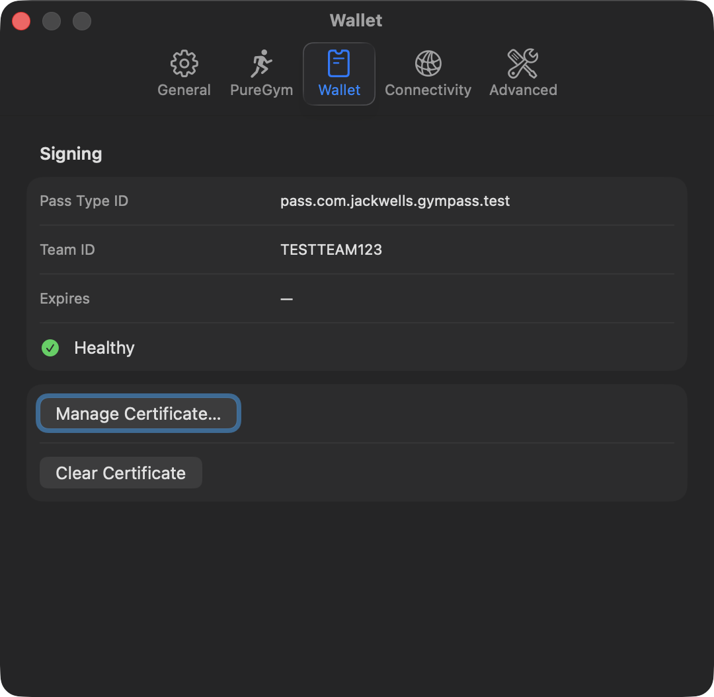
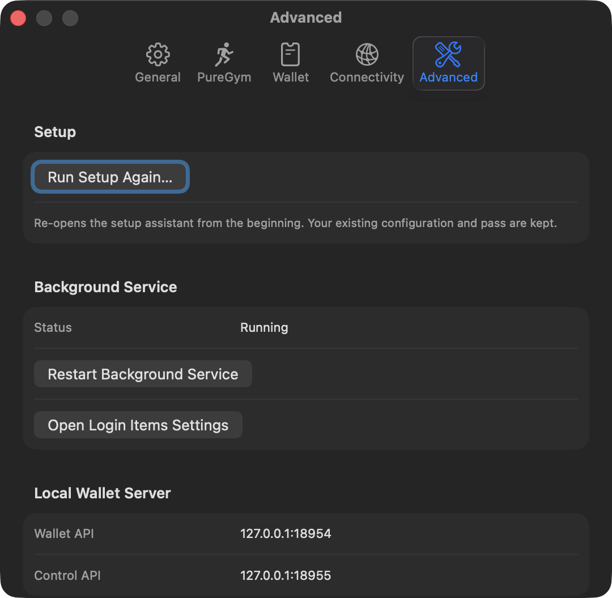

<div align="center">



# GymPass

**Your gym pass, kept current.**

GymPass quietly keeps your PureGym access code up to date in **Apple Wallet**, on your
**iPhone** and **Apple Watch** — so the QR code is always fresh when you scan in.




</div>

---

## Contents

- [What it does](#what-it-does)
- [How it works (in plain English)](#how-it-works-in-plain-english)
- [Screenshots](#screenshots)
- [Prerequisites](#prerequisites)
- [Quick start](#quick-start)
- [Full setup](#full-setup)
- [Architecture](#architecture)
- [Security & privacy](#security--privacy)
- [Testing](#testing)
- [Troubleshooting](#troubleshooting)
- [Known limitations](#known-limitations)
- [Documentation](#documentation)
- [Disclaimer](#disclaimer)

---

## What it does

Your gym entry code changes over time. GymPass removes the chore of digging out the
PureGym app, logging in and re-scanning:

- **Signs in to PureGym** for you and retrieves your current access code.
- **Generates and signs an Apple Wallet pass** (`.pkpass`) containing that code as a QR code.
- **Serves the pass to Apple Wallet** over a small, secure HTTPS endpoint.
- **Pushes an update** to your devices whenever the code changes, so you never present a
  stale QR at the turnstile.
- **Lives in your menu bar** and keeps running in the background — close the window and it
  carries on.

Put simply: **set it up once, add the pass to Wallet, and forget about it.** The right code
is just there when you raise your wrist or pull out your phone.

> GymPass talks to PureGym through their **unofficial mobile API**. It is intended for
> personal use and may stop working if the upstream service changes.

---

## How it works (in plain English)

GymPass is a normal macOS app with two parts that work together:

1. **GymPass** — the window you see. It is just a friendly control panel. It never stores
   your passwords or keys.
2. **The GymPass Agent** — a tiny background service. It holds all the secrets, does the
   real work, and keeps running even when the window is closed.

Here is the whole loop:

1. The agent signs in to PureGym and fetches your **access code**.
2. It builds a **Wallet pass** (`.pkpass`) with that code rendered as a QR code, then
   **cryptographically signs** it so Apple trusts it.
3. Apple Wallet on your iPhone/Watch subscribes to the pass. The agent serves updates
   through a **secured HTTPS tunnel** to your home Mac — no port forwarding, no router
   changes.
4. When the code changes, the agent publishes the new pass and asks Apple to **push a
   notification** to your devices. They quietly fetch the update in the background.
5. When you reach the gym, you open the pass and present the QR. If your devices were
   offline, they still fetch the newest code the next time they check.

```text
   ┌─────────────────────┐   local, token-authenticated   ┌────────────────────────────┐
   │    GymPass.app      │ ─────────────────────────────▶ │   GymPass Agent            │
   │  (the window / UI)  │ ◀───────────────────────────── │  (background service)      │
   └─────────────────────┘         status & activity      └──────────────┬─────────────┘
                                                                          │
                    ┌──────────────────────┬──────────────────────────────┼───────────────────────┐
                    ▼                      ▼                              ▼                       ▼
             PureGym API            Apple Wallet updates            Cloudflare Tunnel       macOS Keychain
          (sign in, get code)   (push + device registration)   (secure public HTTPS)   (secrets & signing key)
```

Everything that touches a secret lives in the agent. The UI is deliberately "dumb", so a
bug in a screen can never leak your PIN or signing key.

---

## Screenshots

### Wallet — live pass preview and appearance
Edit the pass title, colours and member-name visibility, with a live preview of exactly
what Wallet will show.



### Activity — a plain-English history
Every check, publish and push, explained in human terms. No log files to read.



### Diagnostics — proof, not vibes
See the real state of the agent, PureGym session, signing certificate, pushes and the
public endpoint. Export a redacted report when asking for help.



### Setup assistant — guided first run
A short wizard walks you through PureGym, the Wallet certificate and automatic updates.

<table>
<tr>
<td width="50%"></td>
<td width="50%"></td>
</tr>
<tr>
<td align="center"><sub>Guided setup, re-runnable any time from <b>Settings → Advanced</b>.</sub></td>
<td align="center"><sub>Point updates at your own Cloudflare hostname.</sub></td>
</tr>
</table>

<table>
<tr>
<td width="50%"></td>
<td width="50%"></td>
</tr>
<tr>
<td align="center"><sub>Import and self-test your Pass Type ID certificate.</sub></td>
<td align="center"><sub>Preferences, refresh policy and maintenance tools.</sub></td>
</tr>
</table>

---

## Prerequisites

### 1. An Apple Developer account (required for a real pass) ⚠️

This is the one part that cannot be automated, and it is **required to install a pass on a
real iPhone or Apple Watch**.

You need a **paid Apple Developer Program membership** so you can create a **Pass Type ID
certificate**. Apple only lets Wallet install passes that are signed by a certificate tied
to your developer account. Approximate cost is **99 USD/year**.

You will create:

- A **Pass Type ID** (for example `pass.com.yourname.gympass`).
- Its **certificate + private key**, exported as a `.p12` file.

The step-by-step walkthrough is in **[Full setup → Apple Wallet](#3-apple-wallet-certificate-required-for-real-passes)**
and in [`docs/wallet-setup.md`](docs/wallet-setup.md).

> **Without this**, GymPass still builds, signs and verifies passes using a bundled
> **test identity**, so you can explore the whole app and run every test — but the pass
> will **not** install on a real device.

A **Developer ID Application** certificate is *optional*. It is only used to sign the
`GymPass.app` bundle for distribution. Local/self-use builds are ad-hoc signed by default.

### 2. A Mac

- **macOS 26 or later** (Apple Silicon tested).
- **Swift 6.3 toolchain.** A full **Xcode install is not required** — the Command Line
  Tools are enough (`xcode-select --install`).

### 3. Automatic updates (optional, but recommended)

To update the pass while you are away from your Mac, you need a stable public HTTPS
address. GymPass uses an **outbound Cloudflare Tunnel**, so there is no port forwarding
and no inbound firewall rule.

- A **Cloudflare account** with a domain on Cloudflare.
- `cloudflared` installed: `brew install cloudflared`.

Without this, GymPass can still generate a pass, but it cannot push automatic updates.

### 4. A PureGym account

Your normal **email + PIN**. GymPass signs in for you; it never needs your password elsewhere.

---

## Quick start

### Try it instantly in demo mode (no accounts, no credentials)

Demo mode simulates PureGym, Apple Push and the tunnel so you can explore the entire app
safely.

```bash
git clone git@github.com:jrgwells/GymPass.git GymPass
cd GymPass

# Terminal 1 — a mock background service
swift run GymPassAgent --demo

# Terminal 2 — the app
swift run GymPassApp
```

The window finds the agent automatically. You can import the bundled **test certificate**
under **Settings → Wallet → Manage Certificate…** to exercise pass generation:

- File: `Tests/Fixtures/test-identity.p12`
- Password: `gympass-test`

> The test certificate is **not trusted by Apple** and produces a pass that will not
> install on a device. It exists purely so you can build, sign and verify locally.

### Build the real app

```bash
swift build                 # build everything
swift run GymPassTests      # run the test suite (36 tests)
./scripts/build-app.sh      # assemble and sign dist/GymPass.app
open dist/GymPass.app       # launch it
```

To sign the bundle with a Developer ID (optional):

```bash
CODESIGN_IDENTITY="Developer ID Application: Your Name (TEAMID)" ./scripts/build-app.sh
```

There is a `Makefile` with shortcuts too: `make build`, `make test`, `make app`, `make run-demo`.

---

## Full setup

Once you have a build, open **GymPass.app** and follow the setup assistant. You can re-run
it any time from **Settings → Advanced → Run Setup Again…** or with **⌘⇧S**.

### 1. Keep it running in the background

Click **Install Background Service** when prompted (or **Settings → General → Run GymPass in
the background**). macOS may ask for approval; if it does, use **Settings → Advanced → Open
Login Items Settings**.

The agent then continues running when the window is closed **and** when you quit the app.

| Your Mac | What happens |
|---|---|
| Window closed | Agent keeps running |
| App quit | Agent and tunnel keep running |
| Screen locked | Agent keeps running |
| Asleep | Pauses, then recovers on wake |
| Logged out / before login | Per-user agent is unavailable |

### 2. Connect PureGym

In the wizard (or **Settings → PureGym**), enter your **email and PIN**. GymPass signs in,
pulls your current access code and shows the pass immediately.

### 3. Apple Wallet certificate (required for real passes)

See [`docs/wallet-setup.md`](docs/wallet-setup.md) for the detailed walkthrough. Summary:

1. Sign in at <https://developer.apple.com/account> → **Certificates, Identifiers & Profiles**.
2. **Identifiers → Pass Type IDs → +**. Register a reverse-DNS name such as
   `pass.com.yourname.gympass`.
3. **Certificates → + → Pass Type ID Certificate**. Select the Pass Type ID, generate a CSR
   with Keychain Access (**Certificate Assistant → Request a Certificate From a Certificate
   Authority**), upload it, and download the `.cer`.
4. Import the `.cer` into your **login** keychain. It pairs with the private key you made.
5. Select the certificate **and** its private key → **File → Export Items… → Personal
   Information Exchange (.p12)**. Set a password.
6. In GymPass **Settings → Wallet → Manage Certificate…**, choose the `.p12` and enter its
   password.

GymPass derives the **Pass Type ID** and **Team ID** from the certificate, stores the
identity in your **Keychain**, and runs a signing self-test. **Diagnostics → Test Signing**
should report *Signed and verified*.

### 4. Automatic updates (Cloudflare Tunnel)

See [`docs/cloudflare-setup.md`](docs/cloudflare-setup.md). Summary:

```bash
cloudflared tunnel login
cloudflared tunnel create gympass
cloudflared tunnel route dns gympass wallet.example.com
```

Then in **Settings → Connectivity**:

- Provider: **Cloudflare Tunnel**
- Public hostname: `wallet.example.com`
- Paste the tunnel token → **Apply** → **Test Connection**

> **Do not** use a temporary Quick Tunnel (`trycloudflare.com`) as the permanent address —
> it changes on every restart and gets baked into installed passes.

Cloudflare should route **only** `/v1/*` and `/install/*` to GymPass. The admin control API
listens on a **separate local port that is never tunneled**.

### 5. Install the pass

Open the **Dashboard → Add to Apple Wallet**, then **scan the installation code** (shown in
the app) with your iPhone. This code is distinct from your gym entry code.

On **Apple Watch**: double-click the side button, select the pass, and present the QR to the
scanner.

### 6. Verify everything

- **Diagnostics → Test Signing** → *Signed and verified*
- **Diagnostics → Test Remote Access** → *Reachable*, with a latency
- Visit `https://wallet.example.com/health` → `{"status":"ok"}`
- Confirm `https://wallet.example.com/control/status` returns **404** (the admin API is not exposed)

---

## Architecture

```text
GymPass.app
├── GymPass (SwiftUI control panel)
│   └── talks to the agent over a loopback, token-authenticated control API
└── GymPassAgent (background service, registered as a per-user LaunchAgent)
    ├── PureGymClient              authentication, QR retrieval, rate limiting
    ├── RefreshEngine              scheduling, coalescing, atomic publication
    ├── WalletPassService          pass.json + assets + manifest + CMS signature
    ├── WalletHTTPServer           Apple Wallet update protocol (loopback, tunneled)
    ├── ControlServer              local control API (never tunneled)
    ├── APNsClient                 Wallet update notifications
    ├── CloudflareTunnelProvider   supervised outbound tunnel
    ├── DatabaseManager            SQLite (GRDB)
    └── KeychainStore              secrets and signing identity
```

**Key design decisions**

- **The agent owns everything.** The UI never touches the database or Keychain; it sends
  typed requests over a loopback, token-authenticated HTTP API and receives sanitised
  snapshots. No arbitrary commands or file paths cross that boundary.
- **Atomic publication.** The pass archive, revision, timestamps and notification rows
  commit in a **single database transaction**; pushes are sent only after commit. A failed
  step never destroys the last known-good pass.
- **Native signing.** CMS via Apple's Security framework — no OpenSSL binary, no plaintext
  keys on disk.
- **Truthful UI.** The app reports what actually happened (*checked*, *published*, *Apple
  accepted*, *registration received*) rather than inventing device state.

More detail: [`docs/architecture.md`](docs/architecture.md).

---

## Security & privacy

GymPass handles live credentials, so it is built defensively:

- **Secrets in the Keychain.** The agent is the only process that reads them. The UI sends
  credentials over the local control API once and never stores them.
- **Encrypted at rest.** A `.pkpass` is *signed*, not encrypted, so the archive and the raw
  access code are **AES-GCM encrypted** under a Keychain-held key.
- **Minimal public surface.** The Wallet server binds to `127.0.0.1` only; the tunnel exposes
  just `/v1/*` and a short-lived `/install/*`. The admin control API lives on a separate,
  never-tunneled port.
- **Expiring install links.** Installation uses a separate capability token that expires and
  never reveals your Wallet token.
- **Redacted diagnostics.** A central redactor strips emails, tokens, codes and identifiers,
  so exports and logs cannot leak secrets.
- **No telemetry.** No analytics, no third-party crash reporting, no phone-home.

Full threat model: [`docs/security.md`](docs/security.md).

---

## Testing

```bash
swift run GymPassTests      # 36 tests, 0 failures
```

The suite covers refresh scheduling, redaction of planted secrets, PureGym response
decoding, pass JSON/manifest/zip layout, CMS signing and tamper rejection, persistence and
notification outbox behaviour, the full Wallet route contract, installation links and the
refresh engine.

> `swift test` discovery is broken when only Command Line Tools are installed, which is why
> GymPass ships a small custom runner: use `swift run GymPassTests`.

More: [`docs/development.md`](docs/development.md).

---

## Troubleshooting

| Symptom | Fix |
|---|---|
| "A signing certificate is required" | Import a Pass Type ID `.p12` under **Settings → Wallet** (see [Full setup](#3-apple-wallet-certificate-required-for-real-passes)). |
| Pass won't install on iPhone | The certificate must be a real Apple Pass Type ID cert, not the bundled test identity. |
| "Automatic updates are not set up" | Configure a Cloudflare named tunnel and public hostname under **Settings → Connectivity**. |
| `cloudflared was not found` | `brew install cloudflared`. |
| Background service not approved | **Settings → Advanced → Open Login Items Settings** and allow GymPass. |
| Remote test fails | Confirm the tunnel is running and the hostname routes `/v1/*` and `/install/*` to the Wallet port. |
| Pass shows an old code | Tap **Refresh Now** (⌘R) on the dashboard; devices fetch the newest revision when they next check. |

---

## Known limitations

- **Apple controls pass rendering.** The in-app preview is a close approximation, not a pixel
  replica of iOS/watchOS.
- **Pushes are best-effort.** An offline device fetches the newest revision when it next
  checks; it cannot be forced instantly.
- **GymPass cannot extend your access code.** It only reflects the code PureGym issues.
- **The PureGym QR invalidation contract is unverified.** Refresh defaults to a conservative
  `balanced` policy that can be tuned in Observations/Settings.
- **The app is not sandboxed.** A managed `cloudflared` child process, a LaunchAgent and
  Keychain access are impractical under App Sandbox for v1 — a deliberate trade-off.
- **Real pass installation and Watch use** cannot be verified without a certificate and
  physical devices.

---

## Documentation

- [`docs/architecture.md`](docs/architecture.md) — processes, data flow, storage, IPC
- [`docs/wallet-setup.md`](docs/wallet-setup.md) — Apple Developer certificate steps
- [`docs/cloudflare-setup.md`](docs/cloudflare-setup.md) — tunnel and hostname steps
- [`docs/security.md`](docs/security.md) — threat model and mitigations
- [`docs/development.md`](docs/development.md) — build, test and packaging details
- [`docs/research.md`](docs/research.md) — Apple Wallet protocol and PureGym API findings
- [`docs/final-review.md`](docs/final-review.md) — evidence matrix of what's verified

---

## Disclaimer

GymPass is an independent, unofficial client for PureGym and is not affiliated with,
endorsed by or sponsored by PureGym. It uses an undocumented API that may change without
notice. Use at your own risk, for your own account, for personal use.
